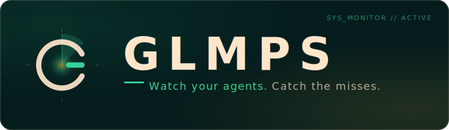

<p align="center">
  
</p>

A local, zero-dependency dashboard that shows, live and per session, what every Claude Code and CLI-agent session on your machine is actually doing: which CLAUDE.md files, skills, subagents, memory, and MCP tools it is using, plus its git activity, file edits, model, context window, and cost. It tails your agents' own session logs, classifies the events, and serves a single-page dashboard with history, full-text search, in-dashboard editing, analytics, and one-click resume.

It is also a lab for catching your own capability misuse: when an agent fails to reach for the right skill, subagent, or hook, GLMPS surfaces that gap and, through the built-in Learning loop, lets you turn the lesson into a durable behavioral guard.

- Runs entirely on localhost (binds `127.0.0.1` only). Nothing leaves your machine.
- Node 18+, no runtime dependencies, no build step for the dashboard.
- MIT licensed.

---

## Table of contents

- [What it tracks](#what-it-tracks)
- [Supported tools](#supported-tools)
- [Requirements](#requirements)
- [Quick start](#quick-start)
- [Setup (one command)](#setup-one-command)
- [Configuration](#configuration)
- [The dashboard](#the-dashboard)
- [The Learning loop](#the-learning-loop)
- [Architecture](#architecture)
- [Project layout](#project-layout)
- [Antigravity companion](#antigravity-companion)
- [State and storage](#state-and-storage)
- [Development](#development)
- [License](#license)

---

## What it tracks

Per live session and across history, GLMPS surfaces:

- **Guiding context** - the CLAUDE.md / GEMINI.md / AGENTS.md files and project memory steering the session.
- **Skills** - which skills were invoked, and which available skills went unused.
- **Subagents** - agents the session dispatched, and the work they did.
- **Memory** - reads and writes to the persistent memory store.
- **MCP tools** - Model Context Protocol tool calls.
- **Git** - commits, diffs, and repository activity.
- **File edits** - what was read and changed, with additions/deletions.
- **Usage** - model, context-window percentage, token counts, duration, and cost (captured from the statusline).
- **Capability gaps** - high-confidence cases where a skill or subagent should likely have been used but was not.

Everything is derived by tailing the agents' own on-disk session logs. GLMPS never instruments or proxies your agents.

## Supported tools

Capture is adapter-based: one self-contained module per tool under `server/lib/adapters/`. Current adapters:

| Tool | Source |
| --- | --- |
| Claude Code | session transcripts (incl. subagents and workflows) |
| Antigravity | brain logs |
| Antigravity CLI (`agy`) | CLI session store |
| Gemini CLI | session logs |
| Codex CLI | session store |
| OpenCode | session store |
| Cline / Roo | VS Code global storage |
| GitHub Copilot Chat | session store |
| Hermes | session store |
| OpenClaw | session store |

Adding a tool means adding an adapter (detect / discover / extract), not editing the core loop.

## Requirements

- Node.js 18 or newer.
- macOS, Linux, or Windows.
- The agent CLIs you want to monitor, installed and used as normal.

No database, no services, no runtime npm dependencies.

## Quick start

```bash
git clone <your-fork-or-clone-url> glmps
cd glmps
npm start
```

Then open http://127.0.0.1:8123.

The dashboard serves `web/` from disk on every request, so edits to the UI are live on refresh - no restart needed. Changes under `server/` or `taps/` require a restart.

## Setup (one command)

For full functionality (per-session cost/context capture and the capability-gap reminders), run the installer once:

```bash
npm run setup
```

This wires GLMPS into your Claude Code config with resolved absolute paths, and is safe and reversible:

1. **config.json** - copies `config.example.json` to `config.json` if you do not have one yet.
2. **Statusline tap** - chains a recorder into `~/.claude/settings.json` that captures each session's model, context window, and cost, then delegates to your previous statusline command (any existing statusline keeps working). Your `settings.json` is backed up to `settings.json.mc-backup` first.
3. **Capability-reminder hook** - installs a `UserPromptSubmit` hook that nudges you toward the right skill/subagent before acting.

It is idempotent (safe to run twice). To revert everything it installed:

```bash
node scripts/install.mjs --uninstall
```

The statusline tap can also be installed on its own with `node taps/install-tap.js` (and removed with `--uninstall`); `npm run setup` wraps it.

## Configuration

Copy `config.example.json` to `config.json` (the installer does this for you) and edit. `config.json` is gitignored. The server merges your file over the defaults, so you only need to set the keys you want to change.

| Key | Default | Purpose |
| --- | --- | --- |
| `port` | `8123` | Port the dashboard listens on (localhost only). |
| `antigravityCommand` | `null` | Path to the Antigravity IDE launcher, used by the terminal launcher and resume. `null` disables those actions. |
| `openInEditorArgs` | `["-g", "{path}"]` | Args passed to `antigravityCommand` to open a file; `{path}` is substituted. |
| `editableRoots` | `[]` | Directories whose files may be edited from the dashboard. Empty means in-dashboard editing is off. |
| `workingThresholdMs` | `10000` | Idle gap under which a session counts as actively working. |
| `idleThresholdMs` | `60000` | Idle gap under which a session counts as idle (vs ended). |
| `inventoryScanMs` | `60000` | How often skill/agent/CLAUDE.md inventory is rescanned. |
| `searchResultCap` | `200` | Max full-text search hits returned. |
| `backfillBytes` | `2097152` | How much of a transcript tail to backfill on first read. |
| `terminals` | Claude / Gemini / Codex / Blank | CLI choices offered by the "New terminal" launcher. |

## The dashboard

The top bar has four views:

- **Live** - a master/detail console. The left rail lists live and recent sessions (tool-colored, with context %, skill/memory/agent/git counts); selecting one expands its banner (title, model, guiding context, capability gaps) and its live event feed, streamed over Server-Sent Events.
- **History** - every recorded session, filterable by project, tool, date, and skill, with full-text search across transcripts and one-click resume.
- **Analytics** - usage over time: cost and token trends, an activity heatmap, and per-model and per-project breakdowns. Hand-built charts, no charting library.
- **Learning** - the capability-gap and idea queue (see below).

Other built-ins: copy-to-prompt for unused inventory, in-dashboard editing of context files (with undo), a "New terminal" launcher that opens a chosen CLI as an Antigravity editor tab, resume-into-Antigravity, and a settings menu to restart the server and open `config.json`.

## The Learning loop

GLMPS does not just show capability gaps - it helps you fix them. The Learning view is a queue fed by two sources:

- **Auto-detected gaps** from `gap-detect.js` (for example, "edited UI files without the frontend-design skill" or "many edits with no subagent delegation").
- **Manual ideas** you type in ("always run lint before committing").

Each item can be **approved**, **discarded**, or given an **alternative** rule. Approving writes a durable guard into your private agent config as a single, revertable git commit:

- Known gap codes apply a deterministic, templated guard.
- Free-form ideas are handed to a headless agent that composes the rule (driven through the Antigravity companion's request queue).

A manual/automated toggle lets the safe, deterministic gap guards apply on their own, while free-form ideas always wait for your approval. Because every apply is one git commit, any learning is trivially reverted. This closes the loop: a miss the dashboard catches today becomes a guard that prevents it tomorrow.

## Architecture

- **`server/`** - a zero-dependency Node 18+ ESM watcher, HTTP server, and SSE hub. It tails session sources, classifies events into a shared shape, and serves the dashboard. Capture is adapter-based under `server/lib/adapters/` (one module per tool: detect / discover / extract).
- **`web/`** - a vanilla JS + CSS single-page dashboard. No framework, no build step; served from disk per request.
- **`taps/`** - the statusline chain tap that records per-session model/context/cost, then delegates to your prior statusline command.
- **`hooks/`** - the capability-reminder `UserPromptSubmit` hook.
- **`scripts/`** - the one-command installer and small maintenance scripts.
- **`companion/`** - an Antigravity (VS Code) extension that auto-starts the server, adds a status-bar opener, and drains resume / terminal / learning-apply requests.

All extractors and the UI share one event shape:

```
{ kind, lane, label, path, tool, ts, sessionId }   // plus optional op, change, model
```

New fields are kept optional so existing consumers never break.

## Project layout

```
glmps/
  server/
    server.js            HTTP + SSE + watcher entrypoint
    lib/
      adapters/          one module per supported tool
      gap-detect.js      capability-gap rules
      learning-*.js      learning queue: store, templates, applier
      ...                inventory, sessions, search, usage, paths, ...
    test/                node:test suites
  web/
    index.html
    app.js               view router + boot
    grid.js detail.js    Live master/detail
    history.js analytics.js learning.js
    styles.css learning.css
    launcher.js settings.js editor.js ...
  taps/                  statusline chain tap + installer
  hooks/                 capability-reminder hook
  scripts/               install.mjs and helpers
  companion/             Antigravity extension
  config.example.json    copy to config.json
  docs/                  specs, plans, publishing checklist
```

## Antigravity companion

The companion is an optional Antigravity (VS Code) extension. It auto-starts the GLMPS server when Antigravity launches, adds a "GLMPS" status-bar button, and executes the dashboard's resume, terminal-launch, and learning-apply requests inside Antigravity terminals.

```bash
cd companion
npm install
npm run build
npm run package
antigravity-ide --install-extension glmps-companion-<version>.vsix
```

Companion settings (in Antigravity): `missionControl.autoStart`, `missionControl.serverPath`, `missionControl.port`.

The companion is the only part of the project allowed dev-only dependencies (esbuild, vsce); the server and web stay dependency-free.

## State and storage

Runtime state lives under `~/.glmps/` - file offsets, the session index, per-session status, usage snapshots, resume/terminal/learning requests, editor undo history, and the learning queue (`state/learning/store.json`). History retention follows each tool's native log pruning; GLMPS archives nothing separately. Delete `~/.glmps/` to reset all runtime state.

## Development

- **Tests:** `npm test` (Node's built-in runner, `node --test`, zero dependencies). Keep it green before claiming anything is done.
- **Run:** `node server/server.js` (or `npm start`), then curl `/api/state` to verify against real data.
- **Conventions:**
  - Zero runtime dependencies in `server/` and `web/`. Dev-only deps are allowed in `companion/`.
  - Test-driven development with `node:test` for every server-lib change; tests live in `server/test/` and isolate via `GLMPS_*` environment overrides (they never touch your real `~/.claude`).
  - XSS discipline: all user/file-derived data is rendered via `textContent` / `createElement`. Never assign data to `innerHTML`.
  - Add a tool by adding an adapter under `server/lib/adapters/`, not by editing the core loop.

## License

MIT. See [LICENSE](LICENSE). Before making a clone public, run through [docs/PUBLISHING.md](docs/PUBLISHING.md).
